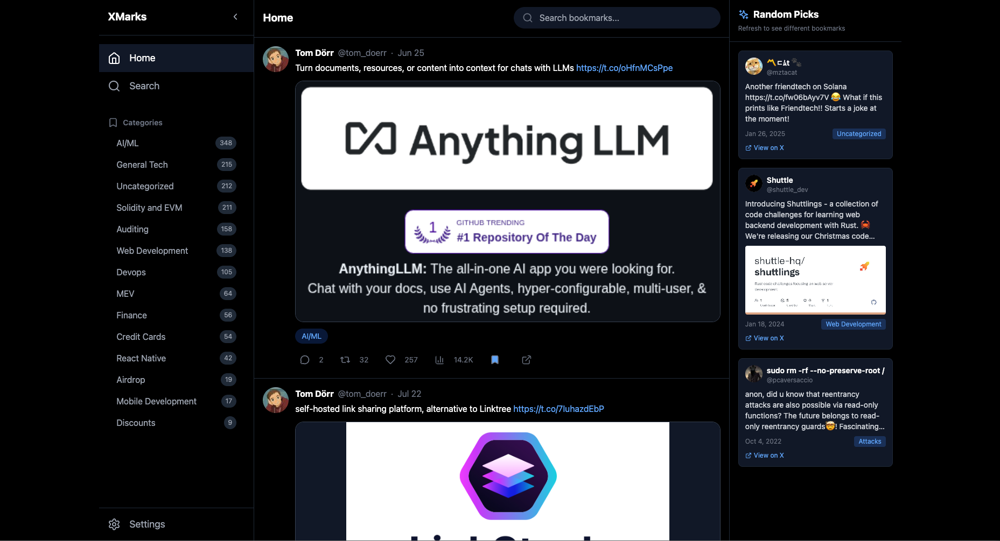

# Xmarks - X Bookmark Dashboard

A local-first, dark-themed dashboard to organise, browse, and rediscover your X (Twitter) bookmarks. It gives you the feel of exploring x.com in dark mode — with AI-powered auto-categorisation, full-text search, random bookmark surfacing, inline translation, one-click media downloading, and simple data management.

Built as a hobby project to actually *do something* with all those bookmarked posts.

## Features

- **Import & Browse** — Import bookmarks exported from X as JSON/CSV and browse them in a familiar tweet-card layout with media previews (images, videos, GIFs)
- **AI Auto-Categorisation** — Categorise bookmarks with AI via [OpenRouter](https://openrouter.ai/) (currently `deepseek/deepseek-v4-flash`), either during import or later per category
- **Full-Text Search** — Search across tweet text, author names, and handles with live suggestions
- **Category Management** — Create and delete categories; change a bookmark's category inline from its card
- **Translate** — One-click "Translate post" on non-English tweets (free Google Translate endpoint, no API key)
- **Media Download** — After import, send every media URL to the bundled API server, which fetches them all in parallel with `aria2c` and names them so the app can find them automatically. A manual `media-urls.txt` fallback is also provided.
- **Random Picks** — Home feed and the right sidebar surface random bookmarks to nudge you into revisiting old saves
- **Local SQLite Database** — All bookmark data lives in your browser via sql.js + IndexedDB. No cloud.
- **Database Export/Import** — Export your entire database as a `.db` file for backup or portability
- **Undo-able Delete** — Remove a bookmark from its card with a 2-second undo toast
- **One-Click Purge** — Wipe all data when you want a fresh start
- **Operation Logging** — Built-in log console for debugging imports, AI runs, and downloads

## Tech Stack

- React 18 + TypeScript + Vite 5
- Tailwind CSS
- sql.js (in-browser SQLite via WASM) + IndexedDB for persistence
- OpenRouter SDK for AI categorisation
- Express 5 API server + `aria2c` for media downloads
- Lucide React icons

## Prerequisites

- Node.js (v18+) and npm
- [aria2](https://aria2.github.io/) (`aria2c` on your PATH) — for server-side media download
- An [OpenRouter](https://openrouter.ai/) API key — for AI categorisation
- [Tampermonkey](https://www.tampermonkey.net/) browser extension + [Twitter Web Exporter](https://github.com/prinsss/twitter-web-exporter) userscript — for exporting bookmarks from X

## Getting Started

### 1. Clone the repository

```bash
git clone https://github.com/azhar0406/xmarks.git
cd xmarks
```

### 2. Install dependencies

```bash
npm install
```

### 3. Configure environment variables

```bash
cp .env.example .env
```

Edit `.env`:

```env
VITE_OPENROUTER_API_KEY=sk-or-v1-your-openrouter-api-key-here
VITE_MEDIA_PATH=/media
VITE_API_URL=http://localhost:3001
VITE_DEFAULT_CATEGORIES=AI/ML,React Native,Devops,Solidity
```

| Variable | Description |
|---|---|
| `VITE_OPENROUTER_API_KEY` | Your OpenRouter API key (get one at [openrouter.ai/keys](https://openrouter.ai/keys)) |
| `VITE_MEDIA_PATH` | URL path where media files are served (default: `/media`) |
| `VITE_API_URL` | Base URL of the media download API server (default: `http://localhost:3001`) |
| `VITE_DEFAULT_CATEGORIES` | Comma-separated list of categories seeded on first launch |

> **Note:** All `VITE_*` variables are embedded in the browser bundle. Keep the app local or behind auth if you deploy it.

The API server reads two optional variables of its own: `MEDIA_DIR` (default `./media` next to `server.js`) and `API_PORT` (default `3001`).

### 4. Run the app

In one terminal, the frontend:

```bash
npm run dev
```

In another, the media download API:

```bash
npm run api:dev
```

Open [http://127.0.0.1:5173](http://127.0.0.1:5173) in your browser. The Settings page shows whether the API server is reachable.

Or run both under PM2:

```bash
npm run api:start      # starts xmarks-frontend and xmarks-api from ecosystem.config.cjs
npm run api:stop
npm run api:restart
```

A systemd unit (`xmarks-api.service`) is included for running the API on a Linux server from `/var/www/xmarks`.



## Exporting Bookmarks from X

This project uses [Twitter Web Exporter](https://github.com/prinsss/twitter-web-exporter) with Tampermonkey to export bookmarks from X.

### Setup

1. Install the [Tampermonkey](https://www.tampermonkey.net/) browser extension
2. Install the [Twitter Web Exporter](https://github.com/prinsss/twitter-web-exporter) userscript

### Export Steps (Read Carefully)

> **Important:** Follow these steps exactly to avoid missing bookmarks due to X's caching behaviour.

1. Open [x.com/i/bookmarks](https://x.com/i/bookmarks) in your browser
2. **Scroll all the way down** until you reach the very bottom of your bookmarks list
3. **Scroll back up to the top** (or press `Home` / `Page Up` repeatedly) — this forces X to load any bookmarks that may have been skipped due to caching issues
4. Repeat steps 2-3 if you have a very large number of bookmarks to ensure everything is loaded
5. **Only after all bookmarks are loaded**, use Twitter Web Exporter to start the export
6. Export the bookmark data as **JSON** format

> **Why the scroll dance?** X.com sometimes doesn't load all bookmarks in a single pass due to its internal caching and lazy-loading. Scrolling to the bottom and back forces the browser to fetch every bookmark. Skipping this step may result in missing bookmarks in your export.

You do **not** need to export media from the userscript — Xmarks downloads it for you (next section).

## Importing into Xmarks

1. Start the dev server and the API server
2. Go to **Settings** (gear icon in sidebar)
3. Under **Import Bookmarks**, upload your exported JSON/CSV file. Optionally tick **Automatically categorize with AI during import**
4. A **Media Download** section appears listing the number of unique media URLs found. Click **Download to Server** — the API server runs `aria2c` and saves everything into `media/` with progress shown in the UI
5. Click **Done — Refresh Page**. Your bookmarks (with media) appear on the Home page

### Manual media download (fallback)

If the API server isn't available, click **Download media-urls.txt** and run aria2c yourself:

```bash
aria2c -i media-urls.txt -x 4 -s 4 --max-connection-per-server=4 -d ./media
```

### Media file naming

Files are stored in `media/` as:

```
{screen_name}_{tweet_id}_{photo|video|animated_gif}_{index}_{YYYYMMDD}.{ext}
```

e.g. `gregpr07_2057939790268604786_animated_gif_1_20260523.mp4`. The app builds this path from each bookmark's data, so no manual linking is required. In dev, Vite serves `media/` at `/media` with video range-request support and a lenient date match.

## AI Categorisation

- **During import** — tick the checkbox before uploading; each batch of 100 is inserted, then categorised one tweet at a time.
- **Later** — in Settings → **AI Categorization**, pick a source (Uncategorized only, all bookmarks, or one existing category to re-categorise) and click the button. Use **Stop** to abort.
- The model can only assign categories that already exist in your list; anything else becomes `Uncategorized`.

## Scripts

| Command | Description |
|---|---|
| `npm run dev` | Start the Vite dev server (frontend) |
| `npm run api:dev` | Start the media download API server (`node server.js`) |
| `npm run api:start` / `api:stop` / `api:restart` | Manage frontend + API under PM2 |
| `npm run build` | Build frontend for production |
| `npm run preview` | Preview production build |
| `npm run lint` | Run ESLint |
| `npm run typecheck` | Run TypeScript type checking |

## API Server

`server.js` is a tiny Express app used only for media downloads:

| Endpoint | Description |
|---|---|
| `GET /health` | `{ ok: true, mediaDir }` — used by the Settings page to show online status |
| `POST /download-media` | Body `{ items: [{ url, filename }] }`. Writes an aria2c input file, starts `aria2c`, returns `{ jobId, total }` |
| `GET /download-status/:jobId` | `{ status: 'running' \| 'completed' \| 'error', total, completed, failed }` |

Job state is kept in memory; progress is estimated from new files appearing in `MEDIA_DIR`.

## Project Structure

```
xmarks/
├── media/                     # Downloaded media files (gitignored contents)
├── logs/                      # PM2 logs (gitignored)
├── server.js                  # Express API: aria2c media downloads
├── ecosystem.config.cjs       # PM2 config (frontend + api)
├── xmarks-api.service         # systemd unit for the API
├── src/
│   ├── components/
│   │   ├── BookmarkCard.tsx   # Tweet-style card: media, translate, category, delete
│   │   ├── LogConsole.tsx     # Debug log viewer
│   │   ├── RightSidebar.tsx   # Random picks panel
│   │   ├── Sidebar.tsx        # Navigation & categories
│   │   └── Toast.tsx          # Toast provider (undo actions)
│   ├── lib/
│   │   ├── database.ts        # sql.js SQLite database layer
│   │   ├── fileSystem.ts      # IndexedDB persistence
│   │   ├── mediaExtractor.ts  # Media URL extraction + API client
│   │   ├── translate.ts       # Google Translate helper
│   │   └── assets.ts          # Default avatar
│   ├── pages/
│   │   ├── Home.tsx           # Random feed with infinite scroll
│   │   ├── Search.tsx         # Full-text search
│   │   ├── Settings.tsx       # Import, export, AI, categories, media download
│   │   └── CategoryView.tsx   # Filtered category view
│   ├── App.tsx                # App shell & page switching
│   ├── main.tsx               # Entry point
│   └── index.css              # Tailwind + custom styles
├── .env.example               # Environment template
├── index.html
├── package.json
├── tailwind.config.js
├── tsconfig.json
└── vite.config.ts             # Vite config + /media dev-serving plugin
```

## License

MIT
